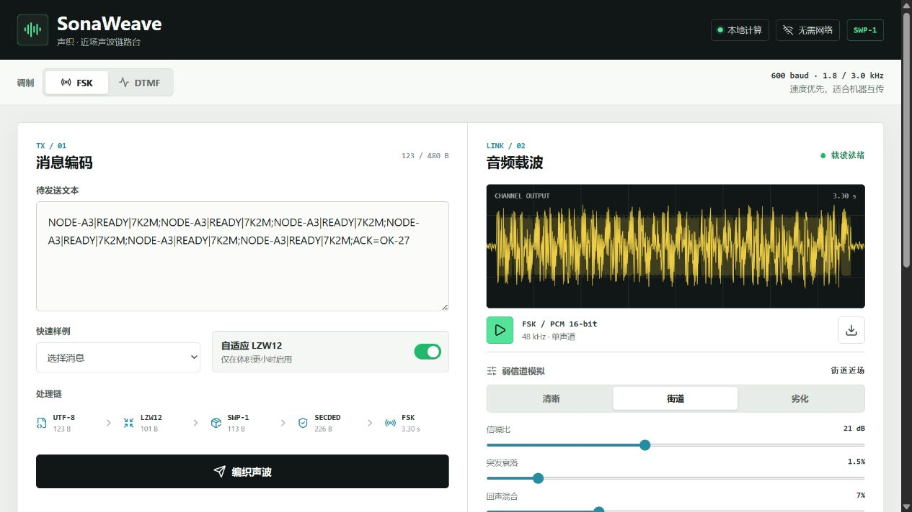

# SonaWeave（声织）

SonaWeave 是一个近距离声学数据链路实验台。它把短文本编码成 FSK 或 DTMF 音频，再从音频文件或麦克风输入中还原原文。Web 版和 Android 版共用同一套 TypeScript 协议实现，整个处理过程都在设备本地完成。



## 在线体验

[sonaweave.pages.dev](https://sonaweave.pages.dev/) 由 Cloudflare Pages 托管。站点使用 HTTPS，浏览器端的编码、音频生成、回环和录音解码仍只在本机执行，不会上传消息或录音。

## 功能

- UTF-8 文本的自适应 LZW12 压缩
- 带长度、消息号和 CRC16 的 SWP-1 帧
- Hamming(8,4) SECDED 单比特纠正与双比特检测
- 600 baud 二进制 FSK 和 16 符号 DTMF
- 48 kHz 单声道 PCM WAV 生成、播放和导入
- 浏览器麦克风录音解码
- 可调信噪比、突发衰落和回声的回环实验
- CRC、纠正码字数和解调置信度等链路指标

## 本地运行

需要 Node.js 20 或更高版本。

```bash
npm install
npm run dev
```

Vite 默认在 `http://localhost:5173` 启动开发服务器。

测试和生产构建：

```bash
npm test
npm run build
npm run preview
```

生产文件生成在 `dist/`。项目没有服务端接口，可以部署到任意静态托管平台。

## 数据链路

发送端：

```text
UTF-8 -> LZW12 -> SWP-1 + CRC16 -> Hamming SECDED -> FSK/DTMF -> PCM
```

接收端按相反顺序完成同步、频率判决、纠错、CRC 校验、解压和文本还原。更具体的帧布局与调制参数见 [SWP-1 协议说明](docs/PROTOCOL.md)。

## 使用方式

1. 输入文本并选择 FSK 或 DTMF。
2. 点击“编织声波”，然后播放或下载生成的 WAV。
3. 使用“运行回环解码”观察不同信道参数下的结果。
4. 在另一台设备播放 WAV，通过“麦克风接收”录音并解码。

浏览器只允许安全上下文调用麦克风。本机 `localhost` 可以直接使用；部署站点需要 HTTPS。非安全上下文仍可使用音频生成、WAV 导入和回环实验。

## Android

Android 版使用 Capacitor 8，支持 Android 7.0（API 24）及以上。应用不声明 `android.permission.INTERNET`；录音需要 `RECORD_AUDIO`，WebView 音频采集还需要普通权限 `MODIFY_AUDIO_SETTINGS`。

```bash
npm run android:debug
npm run android:open
npm run android:smoke
```

构建环境和真机调试步骤见 [Android 开发说明](docs/ANDROID.md)。

## 代码结构

- `src/core/`：压缩、成帧、纠错、信道和调制解调
- `src/platform/`：麦克风访问和 WAV 导出适配
- `src/hooks/useRecorder.ts`：录音生命周期
- `src/App.tsx`：Web 界面和交互流程
- `android/`：Capacitor Android 工程
- `docs/PROTOCOL.md`：SWP-1 帧与物理层参数

## 当前限制

- 接收端需要事先选择与发送端相同的调制模式。
- 目前只有起始同步，没有持续时钟漂移跟踪。
- Hamming SECDED 冗余为 100%，不适合长消息。
- 协议尚未实现分片、ACK、重传、加密和身份认证。
- 实际效果会受到设备频响、自动增益、降噪和房间混响影响。

## License

[MIT](LICENSE)
